# Figure Descriptions

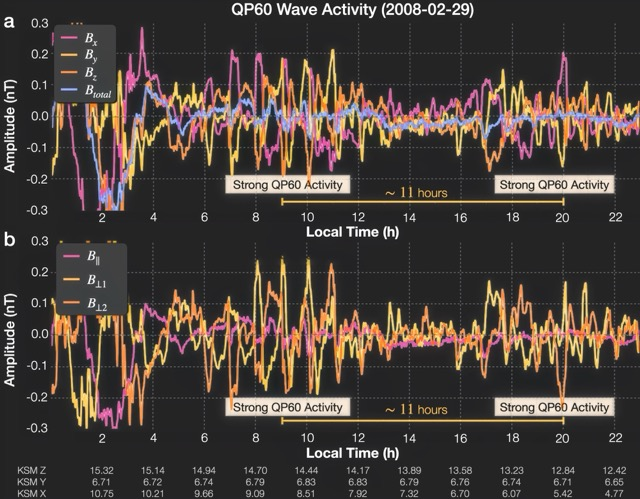
**Figure 1.** (a) Magnetic field perturbations, in KSM coordinates (see text). (b) The same magnetic field perturbations, transformed into a field-aligned coordinate system. Two intervals of particularly high amplitude wave signatures are marked as Strong QP60 Activity. An orange line extends over an \~11-hour interval. Spacecraft ephemeris data (in KSM) are given at the bottom of the plot.

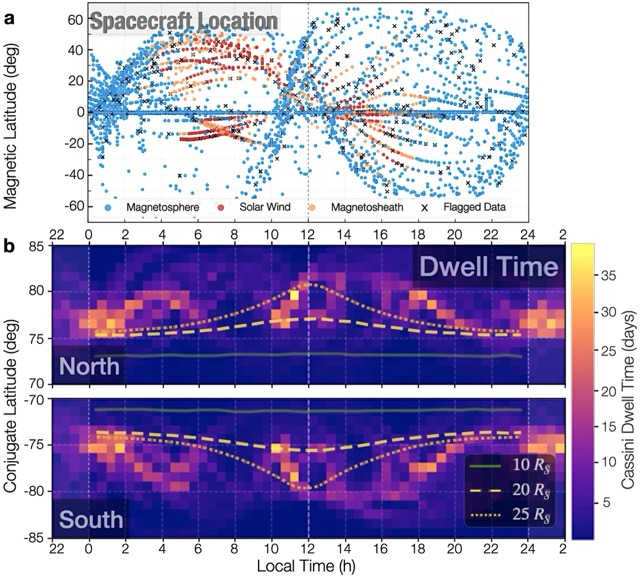
**Figure 2.** (a) The Cassini orbit plotted against local time and magnetic latitude (KSM coordinates). The colors indicate whether Cassini was in the magnetosphere (blue), the magnetosheath (orange) or the solar wind (red) based on Jackman et al. \[2019\]. Flagged data segments (due to significant data gaps or during calibration times) are marked by black crosses. (b) The time Cassini spent in conjugate latitude and local time bins (see text). The green line gives the position of a shell at 10R~S~, the dashed yellow line a shell at 20R~S~ and dotted yellow line a shell at 25R~S~.

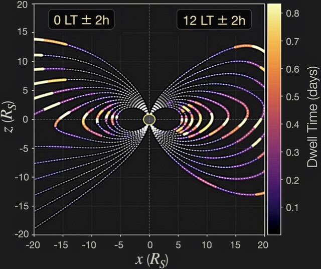
**Figure 3.** Cassini orbiter dwell time, restricted to 0$LT \pm$ 2 h and 12LT$\pm$ 2 h shown with color in magnetic latitude bins along typical field lines crossing the magnetic equator at different radial distances past 5$R_{S}$.

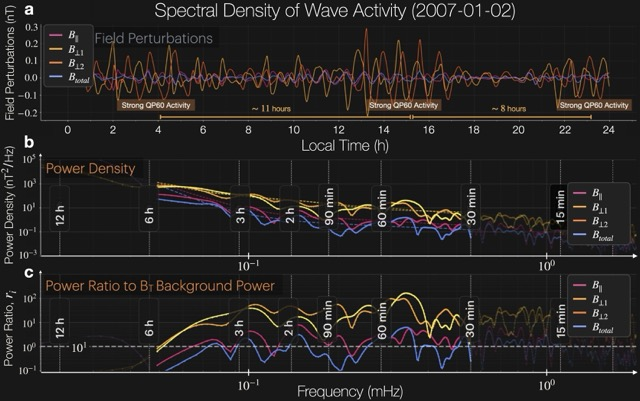
**Figure 4** (a) Magnetic field perturbations in a field-aligned coordinate system and (b) power density for the magnetic field. The colored dotted lines give the estimate of the background power density for the components and the magnetic field magnitude (see text) and (c) gives the ratio of the power density in each component to the background power in the total field. Periods of interest are overlaid in the bottom two panels with dashed vertical lines. The colored dashed lines in Panel b represent estimates of the background power density curves in the 30min to 6h range.

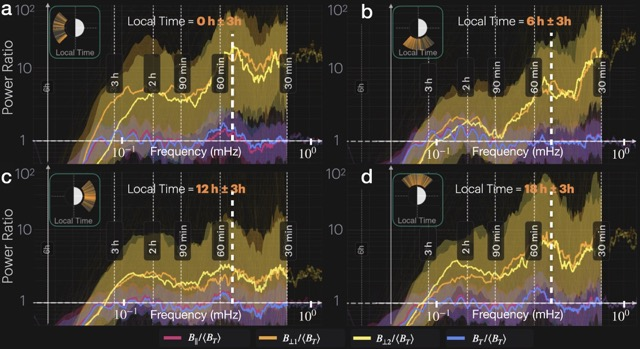
**Figure 5.** Median power ratios of magnetic field perturbations in field-aligned coordinates as defined in the text, with solid color lines plotted versus frequency for different ranges in local time: a) local time of 0+-3h, b) local time of 6+-3h, c) local time of 12+-3h, d) local time of 18+-3h. The lower and upper quartiles for each power ratio are shown as the bottom and top of the shaded areas. Periods corresponding to selected frequencies are labelled on the panels. The white dashed lines show the frequency corresponding to 50m period, the period of the peak in the 0LT bin.

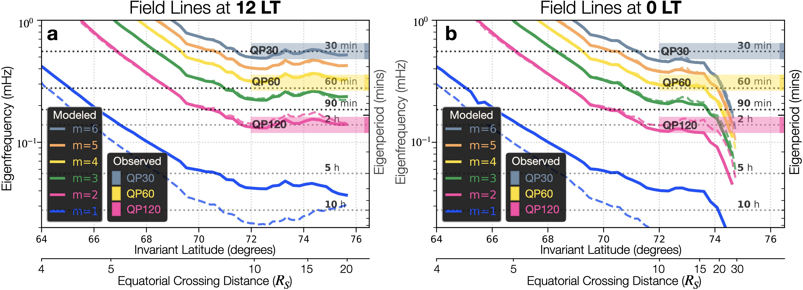
**Figure 6.** Eigenfrequencies for field line resonances in the 12LT (a) and 0LT (b) meridians (adapted from Rusaitis et al., 2021). The power spectral peaks for the dominant waves in the Cassini magnetometer data are superposed by using solid-colored bars: QP30 (grey), QP60 (yellow), and QP120 (magenta).

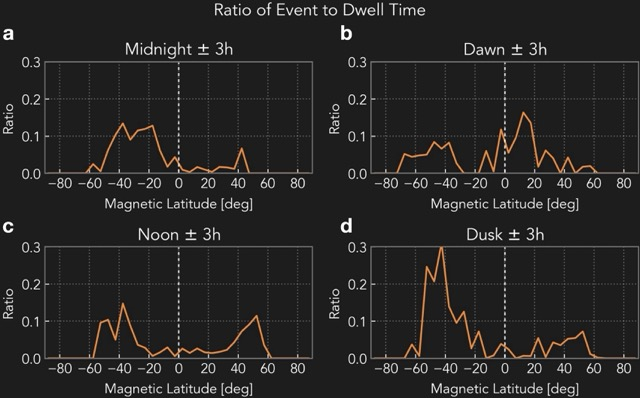
**Figure 7.** Ratio of cumulative event time to orbiter dwell time against magnetic latitude (KSM coordinates) for four local time sectors: (a) 0h±3h LT, (b) 6h±3h LT, (a) 12h±3h LT, (a) 18h±3h LT.

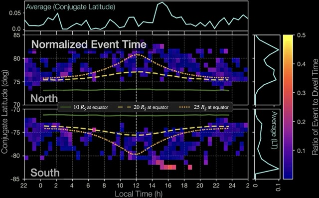
**Figure 8.** Ratio of normalized QP60 cumulative event time to Cassini dwell time in local time - conjugate latitude bins. We calculate the cumulative event time by summing the times in individual bins in local time (top) and in conjugate latitude (side). The cyan lines are averages in local time (top) and conjugate latitude (right).

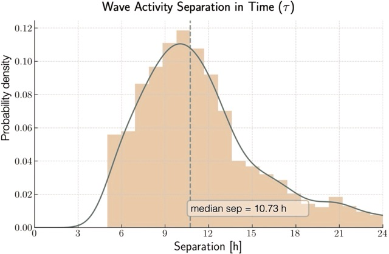
**Figure 9.** Normalized probability distribution of wave train separation time for 60±10 min waves (thick gray line), and the original histogram used for the calculation of the probability distribution (gray bars). The median separation of 10.73 h is shown with a vertical dashed line.

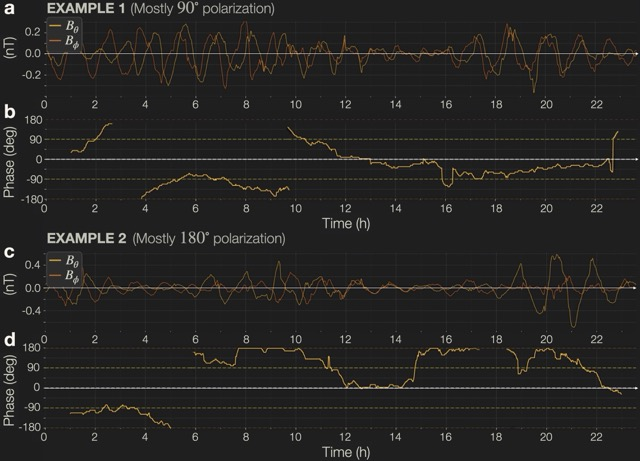
**Figure 10.** Cross-correlation between the two components perpendicular to the background field ($b_{\bot 1}$ and $b_{\bot 2}$), shown for two sample data intervals. Panel (a) gives a time series plot for the first example, with the cross correlation for that interval plotted in (b). The cross-correlation shows mostly a 90-degree phase difference (circular-polarization, most common). Panel (c) gives the time series for the second interval. The cross-correlation for the second interval in (b) has mostly a 180-degree phase difference (linear polarization).

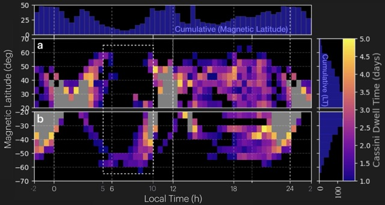
**Figure S1.** Cassini dwell time on closed magnetic flux tubes shown as local time -- magnetic latitude bins. Panel S1a shows the northern hemisphere for magnetic latitudes of 20° to 70°, and Panel S1b shows the southern hemisphere for magnetic latitudes of -20° to -70°. The bins have a resolution of 0.5 h in local time, and 5° resolution in magnetic latitude. Unavailable or oversaturated bins are colored gray. The cumulative time in hours, organized both by local time and magnetic latitude, are shown at the top and to the right of the plot, respectively.

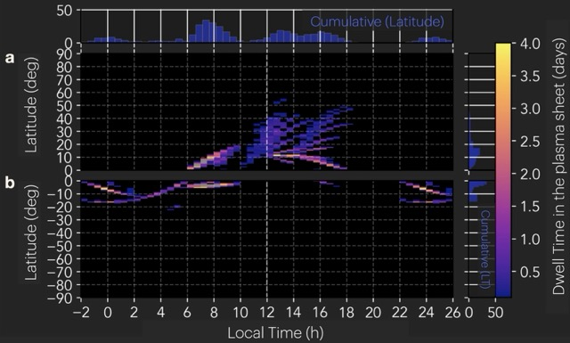
**Figure S2.** Cassini dwell time in the plasma sheet pre-equinox (mid 2004 -- mid 2009), shown as local time -- magnetic latitude bins. The residence in the plasma sheet was determined by a weak magnetic field (< 2 nT) and magnetic field orientation of ±30° to the magnetic equator. Panel S2a shows the northern hemisphere for magnetic latitudes of 0° to 90°, and Panel S2b shows the southern hemisphere for magnetic latitudes of 0° to -90°. The bins have a resolution of 0.5 h in local time, and 1° resolution in magnetic latitude. Unavailable or oversaturated bins are colored black. The cumulative time in hours, organized both by local time and magnetic latitude, are shown at the top and to the right of the plot, respectively.

**Movie S1.** Median power ratios of magnetic field perturbations in field-aligned coordinates as defined in the text, with solid color lines plotted versus frequency for different ranges in local time:$\ b_{||}$ (magenta), $b_{\bot 1}$ (orange), $b_{\bot 2}$ (yellow), and $b_{Total}$ (blue). The lower and upper quartiles for each power ratio are shown as the bottom and top of the shaded areas. Periods corresponding to selected frequencies are labelled on the panels. Four additional panels at the bottom show supplementary information about the 24-hour data segments used in the selected local time ranges at each movie frame. From far left, these panels represent: 1) local time, 2) magnetic latitude, 3) radial position, and 4) the median power of $b_{Total}$ perturbations of the data segments for the 60±10 min band.
